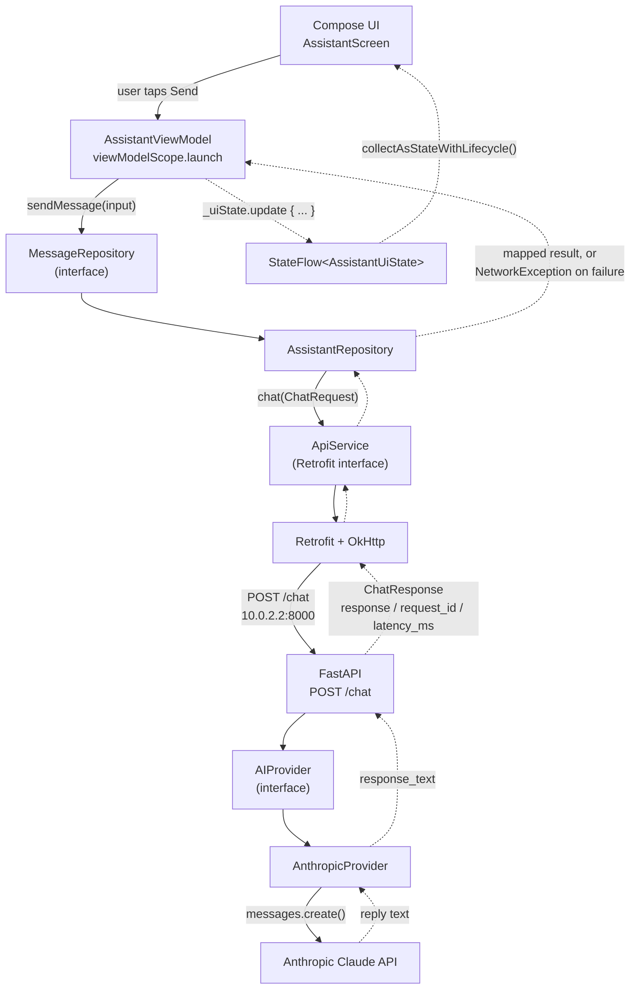

# Mobile AI Assistant

## Overview

This project answers a concrete engineering question: how do you let a phone
app send free-text prompts to a large language model and show the reply,
without embedding a paid API key in the client, and without the UI breaking
or hanging on any of the ordinary ways a mobile network call can fail?

The system is three pieces, each owned end-to-end in this repo:

```
Android app (Kotlin, Jetpack Compose)  →  FastAPI backend (Python)  →  Anthropic Claude API
```

- The **Android app** is a single-screen Compose client: type a prompt, tap
  Send, see a loading indicator, then either the reply or a plain-language
  error message.
- The **FastAPI backend** is a thin, stateless relay: it validates the
  request, assigns a request ID, times the call, forwards the prompt to
  Anthropic, and returns a structured JSON response.
- **Anthropic's Claude API** (`claude-haiku-4-5-20251001`) generates the
  actual reply. The Android app never talks to Anthropic directly and never
  holds the API key — that's the reason the backend exists at all, not an
  incidental detail.

This is a personal/portfolio project. It runs locally against the Android
emulator and a local FastAPI dev server. It has not been deployed anywhere,
containerized, or published to the Play Store — see
[Current Limitations](#current-limitations).

## What I Implemented

**Android (Kotlin + Jetpack Compose, Material 3)**

- **`AssistantUiState`** (`AssistantUiState.kt`) — a single immutable data
  class (`input`, `response`, `isLoading`, `error`) that is the entire state
  of the screen.
- **`AssistantViewModel`** (`AssistantViewModel.kt`) — a `ViewModel` holding
  a `MutableStateFlow<AssistantUiState>`, exposed read-only as
  `StateFlow<AssistantUiState>`. `send()` runs inside `viewModelScope`,
  using structured coroutines rather than callbacks or raw threads.
- **`collectAsStateWithLifecycle()`** (`MainActivity.kt`) — the Compose side
  collects `uiState` lifecycle-aware, so the flow isn't actively collected
  while the screen is backgrounded.
- **Repository abstraction** — `MessageRepository` (interface) /
  `AssistantRepository` (Retrofit-backed implementation), so the ViewModel
  and the network/error-mapping logic can each be unit tested in isolation.
- **Retrofit + OkHttp** (`data/remote/ApiService.kt`,
  `data/remote/RetrofitClient.kt`) — a typed `suspend fun chat(...)` HTTP
  call with explicit connect/read/write timeouts.
- **Android 17 local-network permission** (`MainActivity.kt`,
  `AndroidManifest.xml`) — requests `ACCESS_LOCAL_NETWORK` at runtime on API
  37+, required to reach the emulator's `10.0.2.2` host alias.
- **18 JVM unit tests** (`AssistantViewModelTest.kt`,
  `AssistantRepositoryTest.kt`, plus the generated `ExampleUnitTest.kt`),
  verified via `./gradlew test`.

**Backend (FastAPI)**

- **`POST /chat`** (`app/main.py`) — the only endpoint; accepts
  `{"message": "..."}`, returns `{"response", "request_id", "latency_ms"}`.
- **Pydantic validation** — `ChatRequest` uses a `field_validator` to reject
  blank/whitespace-only messages with a `422` before the AI provider is ever
  called.
- **Anthropic provider abstraction** (`app/providers.py`) — an `AIProvider`
  ABC with two implementations: `AnthropicProvider` (real, wraps
  `anthropic.AsyncAnthropic`) and `MockProvider` (deterministic, used by
  every test).
- **Request IDs** — a fresh `uuid4` generated per request, returned to the
  client and included in every log line for that request.
- **Latency measurement** — `time.perf_counter()` around the provider call,
  returned as `latency_ms`.
- **Structured logging** — `logger.info`/`logger.error` lines carrying
  `request_id`, `provider`, `status`, `latency_ms`, and on failure
  `error_type`/`http_status` — never the prompt or the reply text.
- **Error handling / timeout handling** — `AnthropicProvider` catches the
  SDK's `APITimeoutError`, `APIConnectionError`, and `APIStatusError` and
  re-raises a single `ProviderUnavailableError`, which the route turns into
  a `503`; anything else unexpected becomes a `500`.
- **6 pytest tests** (`tests/test_chat.py`), verified via `pytest`.

## Resume Claim → Implementation Evidence

| Resume claim | How this project demonstrates it | Relevant files/tests |
|---|---|---|
| Android application structure | Single-Activity Compose app split into clear layers: state, ViewModel, UI, and a `data` package separating the repository interface from the Retrofit/remote implementation. | `MainActivity.kt`, `AssistantUiState.kt`, `AssistantViewModel.kt`, `data/AssistantRepository.kt`, `data/MessageRepository.kt`, `data/remote/`, `AndroidManifest.xml` |
| Lifecycle-aware state management | `AssistantViewModel` extends `ViewModel`, so `uiState` and any in-flight `viewModelScope` coroutine survive configuration changes; the UI collects via `collectAsStateWithLifecycle()`, which stops collecting once the screen drops below `STARTED`. | `AssistantViewModel.kt`, `MainActivity.kt` (`collectAsStateWithLifecycle()` call) |
| REST API integration | A typed Retrofit interface (`ApiService.chat`) issues a `POST /chat` over OkHttp; `AssistantRepository` wraps the call; the backend implements the matching FastAPI route. | `data/remote/ApiService.kt`, `data/remote/RetrofitClient.kt`, `backend/app/main.py` |
| Prompt-based AI interaction | Free text typed by the user becomes `ChatRequest.message`, forwarded by the backend as the `messages` payload to Anthropic's `messages.create`, under a fixed `SYSTEM_PROMPT`. | `MainActivity.kt` (`OutlinedTextField` → `viewModel.send()`), `data/remote/model/ChatRequest.kt`, `backend/app/providers.py` |
| Loading state | `AssistantUiState.isLoading` is set `true` before the suspend call and cleared in both the success and failure branches; the UI shows a `CircularProgressIndicator` while it's true. | `AssistantUiState.kt`, `AssistantViewModel.kt` (`send()`), `MainActivity.kt`, `AssistantViewModelTest.kt`'s `` `send sets isLoading true while request is in flight` `` |
| Error state | `AssistantUiState.error: String?`, populated from exceptions that `AssistantRepository` maps to plain-language messages, rendered conditionally in the UI. | `AssistantUiState.kt`, `AssistantRepository.kt`, `MainActivity.kt`, `AssistantViewModelTest.kt` failed-send tests, `AssistantRepositoryTest.kt` |
| API result handling | The Gson-deserialized `ChatResponse` is unwrapped in `AssistantRepository.sendMessage`, and the resulting text is written into `uiState.response` for display. | `data/remote/model/ChatResponse.kt`, `AssistantRepository.kt`, `MainActivity.kt` |
| Local state management | One `MutableStateFlow<AssistantUiState>` is the single source of truth for input, response, loading, and error; `clear()` resets it to a blank `AssistantUiState()`. State is in-memory only — there is no persistence layer. | `AssistantViewModel.kt`, `AssistantUiState.kt` |
| Kotlin | The entire Android module (`src/main`, `src/test`) is Kotlin, built with Kotlin DSL Gradle scripts, using coroutines (`viewModelScope`, `suspend fun`) throughout. No `.java` source files exist in the app module. | `android/app/build.gradle.kts`, all files under `android/app/src/**/*.kt` |
| Mobile performance/network constraints | Explicit OkHttp timeouts bound how long a slow network can block a request; the network call runs off the main thread as a suspend function; there is no polling. | `data/remote/RetrofitClient.kt` (10s connect / 30s read / 10s write), `AssistantViewModel.kt` |
| Battery-aware design considerations | No background service, `WorkManager`, or polling exists — a network call only happens inside the explicit Send button's `onClick`; lifecycle-aware collection avoids recomposition work while the screen isn't visible. These are architectural choices; no battery consumption was measured. | `MainActivity.kt` (`Button(onClick = viewModel::send)`, `collectAsStateWithLifecycle()`), `AndroidManifest.xml` (no `<service>`/`<receiver>`) |
| API latency handling | The backend times every provider call with `time.perf_counter()` and returns `latency_ms` in the response body; the client bounds worst-case wait with an OkHttp read timeout. | `backend/app/main.py` (`chat()`), `data/remote/model/ChatResponse.kt` (`latencyMs`), `data/remote/RetrofitClient.kt` |
| Fallback/error behavior | `AssistantRepository` catches `SocketTimeoutException`, `IOException`, `HttpException`, `JsonParseException`, and generic `Exception` and maps each to a specific user-facing string instead of a raw stack trace; the backend distinguishes `422` (validation), `503` (provider unavailable), and `500` (internal). This is graceful network/server error handling, **not** offline fallback — see the note below. | `AssistantRepository.kt`, `AssistantRepositoryTest.kt`, `backend/app/main.py`, `backend/app/providers.py`, `backend/tests/test_chat.py` |
| Android UI best practices | Declarative Compose UI built from Material 3 components (`OutlinedTextField`, `Button`, `CircularProgressIndicator`, `Scaffold`), state hoisting (`AssistantScreen` is a pure function of `uiState` plus callbacks — it holds no state of its own), edge-to-edge layout, and a `@Preview` composable for design-time iteration. | `MainActivity.kt`, `ui/theme/Theme.kt`, `ui/theme/Color.kt`, `ui/theme/Type.kt` |

**On the fallback/error-behavior claim specifically:** the resume phrase
"fallback/error behavior" is accurate for what exists — graceful handling of
timeouts, connectivity failures, and server errors, always resolving to a
clear message and a UI that's never stuck loading. It does **not** mean, and
this project does not implement, actual offline AI or an offline
response cache. Every request depends on network connectivity and the
Anthropic API being reachable; true offline inference or a local
response cache is listed as future work, not something already built. If
Java is mentioned anywhere in relation to this project: the app
implementation is Kotlin/JVM-based (the Gradle `sourceCompatibility`/
`targetCompatibility` settings target the JVM bytecode level only), and
there is no meaningful Java source or Java interoperability work in this
codebase to point to.

## Architecture



Solid arrows are the outbound request path; dashed arrows are the response
(or error) flowing back up to the `StateFlow` the UI recomposes from. Every
arrow is also a boundary where the corresponding layer's error-mapping logic
lives — see [Error Handling](#error-handling).

## Android State and Lifecycle

- **Recomposition** doesn't lose anything: `uiState` lives in the
  `ViewModel`, not in a `remember {}` block, so when Compose re-runs
  `AssistantScreen` it's just re-reading the current `StateFlow` value, not
  reconstructing state from scratch.
- **`remember` vs. `ViewModel`**: this app deliberately holds no screen state
  in `remember {}` — `AssistantScreen` is a pure function of `uiState` plus
  the `viewModel` callbacks (`onInputChange`, `send`, `clear`). The only
  local Compose state is transient UI plumbing (the permission launcher),
  not application state.
- **`ViewModel` survives configuration changes** (e.g. rotation) by
  construction — that's the framework contract `ViewModel` provides — so
  `uiState` and any in-flight `viewModelScope` coroutine are retained across
  rotation without extra code.
- **`collectAsStateWithLifecycle()`** ties collection to the `STARTED`
  lifecycle state: the flow is only actively collected while the screen is
  visible, so no recomposition work happens while it's backgrounded. This is
  the reason it's used instead of the lifecycle-unaware `collectAsState()`.
- **Process death is a real, current limitation.** If the OS kills the app
  process in the background (e.g. under memory pressure), the `ViewModel`
  itself is destroyed and recreated from scratch. There is **no
  `SavedStateHandle` usage** in `AssistantViewModel` — a fully
  killed-and-restored process comes back to a blank `AssistantUiState()`,
  losing whatever was typed or returned. This is documented here rather than
  glossed over.

## Networking and API Integration

- **`POST /chat`** is the only network call in the app. The request body is
  `ChatRequest(message: String)`; the response is
  `ChatResponse(response: String, requestId: String, latencyMs: Int)`
  (`@SerializedName` maps the snake_case backend fields to camelCase Kotlin
  properties) — both defined in `data/remote/model/`.
- **`10.0.2.2` emulator host mapping**: `RetrofitClient.kt` hardcodes
  `BASE_URL = "http://10.0.2.2:8000/"`. The Android emulator can't resolve
  `localhost` as "the host machine" — inside the emulator, `localhost` means
  the emulator itself — so `10.0.2.2` is the special alias the emulator's
  virtual router provides to reach the host's loopback interface. It only
  works emulator-to-host; it is not a routable address on a physical device
  or in any real deployment.
- **OkHttp timeouts**: `RetrofitClient.kt` configures a 10s connect timeout,
  30s read timeout, and 10s write timeout on the shared `OkHttpClient`. This
  bounds how long a hung connection, a slow response, or a slow request body
  can block a call.
- **Coroutine-based async call**: `ApiService.chat()` is a `suspend fun`,
  called from `AssistantViewModel.send()` inside `viewModelScope.launch`.
- **Why network work doesn't block the main thread**: `viewModelScope` runs
  on `Dispatchers.Main.immediate` by default, but the actual HTTP call
  happens on OkHttp's own dispatcher thread pool via Retrofit's coroutine
  support — the main thread is only touched to apply
  `_uiState.update { ... }` immediately before and after the suspend point,
  which is cheap. That's why the UI can show a `CircularProgressIndicator`
  and stay responsive for the entire duration of a request.

## Error Handling

`AssistantRepository.sendMessage` catches specific exception types and maps
each to a plain-language message before it ever reaches the ViewModel or UI:

| Failure | Caught as | User-facing message |
|---|---|---|
| Timeout | `SocketTimeoutException` | "The request took too long. Please try again." |
| Connectivity / DNS / other IO failure | `IOException` | "Unable to connect. Check your network and try again." |
| Backend returns HTTP 5xx | `HttpException`, code in 500..599 | "The AI service is temporarily unavailable. Please try again." |
| Backend returns other HTTP error | `HttpException`, other code | "Something went wrong. Please try again." |
| Malformed response body | `JsonParseException` | "Received an invalid response. Please try again." |
| Backend AI provider failure | Surfaces as HTTP 503 from the backend, mapped by the 5xx branch above | "The AI service is temporarily unavailable. Please try again." |
| Anything else unexpected | generic `Exception` | "Something went wrong. Please try again." |

In every branch, `AssistantViewModel.send()`'s `catch` block sets
`isLoading = false` and populates `error`, so the UI can never end up stuck
on a spinner with no way forward. All seven mappings are individually
covered by `AssistantRepositoryTest.kt`.

**Why automatic retry was deliberately not added to `POST /chat`:** an
Anthropic call costs money per request. If the client (or the backend)
silently retried on every ambiguous failure — a timeout, a dropped
connection — it could easily generate a second, billed AI request for a
first request whose completion status is genuinely unknown (the backend may
have already called Anthropic and be waiting on a slow reply when the client
gives up). Retrying blind in that situation risks duplicate generated work
and duplicate cost for a single user action. Instead, the current behavior
on any failure is: fail fast, surface a clear message, and let the user
decide whether to press Send again. Retry-with-backoff is listed under
[Production Improvements](#production-improvements) as something that would
need its own explicit policy (which errors are retry-safe, backoff, a retry
budget) rather than being bolted on as a default.

## Backend AI Layer

- **`POST /chat`** (`app/main.py`) validates the request, resolves an
  `AIProvider` via FastAPI's `Depends(get_provider)`, times and logs the
  call, and returns the structured response.
- **`AIProvider`** (`app/providers.py`) is an `ABC` with one method,
  `complete(message: str) -> str`. Depending on the concrete provider, the
  route's behavior is identical — the route has no Anthropic-specific code
  in it at all.
- **`AnthropicProvider`** wraps `anthropic.AsyncAnthropic`, calling
  `messages.create()` with a fixed `SYSTEM_PROMPT` and
  `model="claude-haiku-4-5-20251001"`. It catches the SDK's
  `APITimeoutError`, `APIConnectionError`, and `APIStatusError` and
  re-raises a single `ProviderUnavailableError`.
- **`MockProvider`** returns a deterministic string
  (`f"Mock response to: {message.strip()}"`) with no network call at all. It
  is injected into every backend test via
  `app.dependency_overrides[get_provider]`, so the test suite never calls
  the real Anthropic API, never needs a key, and never costs money to run.
- **`ANTHROPIC_API_KEY` is environment-only.** `AnthropicProvider.__init__`
  reads it via `os.environ["ANTHROPIC_API_KEY"]` and raises `KeyError`
  (fail-fast) if it's missing. It is read exactly once, server-side.
- **Why the key is never in the Android APK**: the app has no reference to
  Anthropic at all — it only knows the backend's URL. Anything shipped
  inside an APK is extractable (decompilation, network interception, memory
  dumping), so the key never becomes part of a distributable artifact.
  `get_provider()` is also a lazy singleton — `AnthropicProvider()` (and the
  `os.environ` read that could raise `KeyError`) is only constructed on the
  first real request, not at import time, which is why the test suite can
  import `app.main` and override the dependency without `ANTHROPIC_API_KEY`
  being set at all.
- **Pydantic validation**: `ChatRequest.message` has a `field_validator`
  that rejects an empty or whitespace-only string with a `ValueError`,
  which a custom `RequestValidationError` handler turns into a `422` with
  `{"error": "invalid_request", "detail": [...]}` — the provider is never
  invoked for an invalid request.
- **Provider failure → HTTP 503**: any `ProviderUnavailableError` raised
  from `AnthropicProvider.complete()` is caught in the route and turned into
  `HTTPException(503, detail="ai_provider_unavailable")`; any other
  unexpected exception becomes a `500`. Both are logged at `ERROR` before
  being raised.

## Observability

Every `/chat` call is logged with structured, greppable fields — never the
prompt text or the model's reply:

- **`request_id`** — a fresh `uuid4`, generated before the provider is
  called, returned to the client in `ChatResponse.request_id` **and**
  included in every log line for that request, so a client-reported failure
  can be traced back to a specific server-side log line.
- **`latency_ms`** — measured with `time.perf_counter()` around the
  provider call, logged and returned to the client on both success and
  failure.
- **`provider`** — the concrete provider class name (`AnthropicProvider` or
  `MockProvider`), logged on every request.
- **`status`** — `ok` on success, `error` on failure.
- **`error_type`** — the exception's class name, logged only on failure.
- **HTTP status** — logged as `http_status` on failure (`503` or `500`).

`tests/test_chat.py` asserts this directly:
`test_successful_request_logs_at_info` checks the INFO line contains
`status=ok`, `latency_ms=`, and `provider=`; `test_provider_failure_logs_at_error`
checks the ERROR line contains `status=error`, `http_status=503`, and
`error_type=`.

No latency benchmarking has been performed on this project — there is no
load test, no p50/p95/p99 measurement, and no claimed number here. Any
latency observed while manually running the app during development was a
one-off observation of a single local call against a local dev server, not
a benchmark, and isn't reported as a number in this document for that
reason.

## Testing

**Android — 18 JVM unit tests**, run with `./gradlew test`, verified via the
generated JUnit XML reports (`1 + 8 + 9 = 18` across the three test
classes):

- `AssistantViewModelTest.kt` (9 tests) — input handling
  (`onInputChange` updates `uiState.input`), `clear()` resets to
  `AssistantUiState()`, the success path (response stored, `isLoading`
  false, `error` null), the failure path (`error` populated, `isLoading`
  false, no crash), and — using a `StandardTestDispatcher` and a
  `FakeSlowRepository` that suspends on a `CompletableDeferred` —
  `` `send sets isLoading true while request is in flight` ``, which
  directly observes the mid-flight loading state rather than just its
  start/end values.
- `AssistantRepositoryTest.kt` (8 tests) — the success path, and every entry
  in the error-mapping table above (`SocketTimeoutException`, `IOException`,
  HTTP 500, HTTP 503, HTTP 400, `JsonParseException`, and a generic
  `RuntimeException` fallback), using a `FakeApiService` that returns or
  throws whatever each test needs.
- `ExampleUnitTest.kt` (1 test) — the Android Studio project template's
  default arithmetic test; left in place, not deleted, but not load-bearing
  evidence of anything.

**Backend — 6 pytest tests**, run with `pytest`, verified via `pytest -q`
(`6 passed`):

- `test_chat_valid_request` — happy path, asserts the response shape and
  that `latency_ms` is a non-negative int.
- `test_chat_blank_message_rejected` / `test_chat_empty_message_rejected` —
  Pydantic validation rejects whitespace-only and empty messages with `422`.
- `test_chat_provider_failure_returns_503` — a `FailingProvider` test double
  that always raises `ProviderUnavailableError`, injected via
  `app.dependency_overrides`, asserts the route returns
  `503`/`ai_provider_unavailable`.
- `test_successful_request_logs_at_info` / `test_provider_failure_logs_at_error`
  — assert the structured log fields described in
  [Observability](#observability) are actually emitted, using pytest's
  `caplog` fixture.

**Why fakes/mocks make these tests deterministic**: on Android,
`FakeSuccessRepository`, `FakeFailureRepository`, `FakeSlowRepository`
(ViewModel tests) and `FakeApiService` (repository tests) never touch
Retrofit or a real socket — each test controls exactly what the layer under
test receives, so the tests are fast (milliseconds) and can't flake on
network conditions. On the backend, `app.dependency_overrides[get_provider]`
swaps in `MockProvider` (or `FailingProvider`) for every test via an
`autouse` fixture, so the real Anthropic API is never called, no API key is
needed to run the suite, and no test run has a dollar cost.

## Mobile Performance and Battery Considerations

- **No continuous polling.** The app makes exactly one network call, and
  only in direct response to the user tapping Send
  (`Button(onClick = viewModel::send)` in `MainActivity.kt`). There is no
  background sync, no `WorkManager` job, no foreground service, and none of
  those component types appear in `AndroidManifest.xml`.
- **Requests run asynchronously.** As covered in
  [Networking and API Integration](#networking-and-api-integration), the
  network call happens on OkHttp's thread pool via a coroutine, not the main
  thread, so the UI never blocks while waiting.
- **Lifecycle-aware `StateFlow` collection** (`collectAsStateWithLifecycle()`)
  avoids collecting — and therefore avoids unnecessary recomposition work —
  while the screen isn't at least `STARTED`.
- **Explicit timeouts prevent hanging network requests** from holding a
  radio connection or a coroutine open indefinitely (10s connect / 30s read
  / 10s write in `RetrofitClient.kt`; a matching 30s timeout on the backend's
  Anthropic client in `providers.py`).
- **Response length is constrained server-side.** `AnthropicProvider.complete()`
  calls `messages.create(max_tokens=512, ...)`, and the `SYSTEM_PROMPT`
  instructs the model to keep replies to 2–4 short paragraphs — both bound
  how much data a single request can pull over the network.
- **Automatic retries were intentionally avoided** (see
  [Error Handling](#error-handling)), which also means no wasted radio
  wake-ups retrying a request that's likely to keep failing.

These are all design choices aimed at limiting unnecessary network, radio,
and CPU work — **no battery consumption was measured or benchmarked on this
project.** There is no claim of a measured battery improvement here, only a
description of the choices that avoid obviously wasteful patterns (polling,
unbounded retries, unbounded response size, background work with no user
trigger).

## Security

- **The Anthropic API key lives only on the backend.** It's read once via
  `os.environ["ANTHROPIC_API_KEY"]` in `AnthropicProvider.__init__`
  (`app/providers.py`) and never appears in any Kotlin, Gradle, or resource
  file — there is nothing to decompile out of the APK because the app has no
  reference to Anthropic at all.
- **`.env` is gitignored; `.env.example` is the safe, committed template.**
  The repository's root `.gitignore` excludes `*.env` (confirmed via
  `git check-ignore -v backend/.env`); `backend/.env.example` contains only
  a placeholder (`ANTHROPIC_API_KEY=your_key_here`) and is the only
  env-related file tracked in git.
- **Prompt and response contents are never logged.** As detailed in
  [Observability](#observability), backend log lines carry `request_id`,
  `provider`, `status`, `latency_ms`, and (on failure) `error_type`/
  `http_status` — never the message text or the model's reply.
- **The local cleartext `10.0.2.2` configuration is development-only.**
  `network_security_config.xml` permits cleartext HTTP to exactly one
  domain, `10.0.2.2` (the emulator-to-host alias), with an explicit comment
  that this must not be used in production; all other cleartext traffic is
  blocked by Android's default HTTPS-only policy.
- **HTTPS would be required in production.** The current setup only works
  because the client and "server" are the same physical machine
  (emulator-to-host loopback). Any real deployment would need a real,
  HTTPS-only backend URL and the removal of the cleartext exception
  entirely — this is listed explicitly under
  [Production Improvements](#production-improvements), not implemented here.

## Current Limitations

- **Local-development backend only** — run via `uvicorn app.main:app --reload`
  on `127.0.0.1:8000`; no containerization, no process manager, no
  deployment target.
- **No authentication or authorization** between the Android app and the
  backend, or on the backend itself.
- **No persistent conversation history** — each send is a single,
  independent request; neither the app nor the backend retains prior turns.
- **No `SavedStateHandle` / process-death restoration** — a fully
  killed-and-restored Android process loses the current screen state (see
  [Android State and Lifecycle](#android-state-and-lifecycle)).
- **No true offline inference** — every request requires network
  connectivity and a reachable Anthropic API; there is no on-device model.
- **No offline cache** — there is no local storage of prior prompts or
  responses to fall back to when offline.
- **No streaming responses** — the backend calls `messages.create()`
  (non-streaming) and returns the full reply in one response body; there is
  no token-by-token streaming to the client.
- **No production deployment** — this has only ever been run locally against
  an emulator and a local dev server.
- **No meaningful Java implementation** — the app is Kotlin/JVM-based
  throughout; there is no Java interoperability work to point to.

## Production Improvements

Realistic next steps, listed as future work — not implemented in this repo:

- Containerize the backend and document an actual deployment path.
- Replace the `10.0.2.2` cleartext exception with HTTPS and a real,
  configurable backend URL (e.g. per Gradle build variant).
- Add request-level authentication between the app and the backend.
- Add conversation history / multi-turn context, likely requiring backend
  state or a client-side `SavedStateHandle`-backed cache.
- Add a deliberate retry-with-backoff policy (which errors are retry-safe,
  backoff schedule, retry budget) instead of the current "fail fast, no
  retry" behavior.
- Add streaming responses so the UI can render partial output instead of
  waiting for the full reply.
- Add rate limiting / a budget guard in front of the Anthropic calls.
- Add instrumented (Espresso) UI tests alongside the existing unit tests.
- Aggregate the existing per-request logs into real metrics (p50/p95/p99
  latency, error rate by type, request volume) instead of raw log lines.

## Repository Structure

```
mobile-ai-assistant/
├── android/
│   └── app/src/
│       ├── main/java/com/sai/mobileaiassistant/
│       │   ├── MainActivity.kt            # Compose UI, permission request, entry point
│       │   ├── AssistantViewModel.kt      # StateFlow<AssistantUiState>, send()/clear()
│       │   ├── AssistantUiState.kt        # input / response / isLoading / error
│       │   ├── data/
│       │   │   ├── MessageRepository.kt   # interface
│       │   │   ├── AssistantRepository.kt # Retrofit impl + error mapping
│       │   │   └── remote/
│       │   │       ├── ApiService.kt          # Retrofit POST /chat
│       │   │       ├── RetrofitClient.kt      # base URL, OkHttp timeouts
│       │   │       └── model/ChatRequest.kt, ChatResponse.kt
│       │   └── ui/theme/                  # Material 3 theme
│       └── test/java/com/sai/mobileaiassistant/
│           ├── AssistantViewModelTest.kt
│           └── data/AssistantRepositoryTest.kt
├── backend/
│   ├── app/
│   │   ├── main.py        # FastAPI app, POST /chat, validation, logging
│   │   └── providers.py   # AIProvider, AnthropicProvider, MockProvider
│   ├── tests/test_chat.py # 6 pytest tests
│   └── .env.example       # safe placeholder; .env itself is gitignored
└── docs/
    ├── architecture.md       # deeper walkthrough of every design decision
    └── interview-notes.md    # spoken-style answers to likely interview questions
```

`docs/architecture.md` and `docs/interview-notes.md` go into more depth than
this README on several of the topics above (timeouts, retries, the
`ACCESS_LOCAL_NETWORK` permission, what survives recomposition vs.
configuration change vs. process death) and are worth reading directly if
preparing to discuss this project.

## Running the Project

**Android** (from `android/`):

```bash
./gradlew installDebug   # build and install on a running emulator
./gradlew test           # run the 18 JVM unit tests
```

The app is hardcoded to call the backend at `http://10.0.2.2:8000/` — it has
only been run against the Android emulator, not a physical device.

**Backend** (from `backend/`):

```bash
python3 -m venv .venv
source .venv/bin/activate
pip install -r requirements.txt

cp .env.example .env        # then fill in a real ANTHROPIC_API_KEY
export $(grep -v '^#' .env | xargs)

uvicorn app.main:app --reload   # binds 127.0.0.1:8000
pytest                          # run the 6 backend tests (uses MockProvider, no key needed)
```

## Interview Talking Points

- **The backend exists for one reason first: the API key can't live in the
  APK.** Anything shipped in a distributable Android app is extractable
  (decompilation, network interception, memory dumping), so the Anthropic
  key stays server-side, and the app only ever knows how to reach my own
  backend.
- **`StateFlow` + `ViewModel` gives me one source of truth that survives
  rotation**, and `collectAsStateWithLifecycle()` means the UI isn't doing
  work while it's not visible — I can point at the actual field
  (`AssistantUiState`) and the actual collection call to back that up.
- **The Repository interface split (`MessageRepository`/`AssistantRepository`)
  is what makes 17 of the 18 Android tests possible without Retrofit or a
  real socket** — I can walk through `AssistantViewModelTest` and
  `AssistantRepositoryTest` and show exactly what each fake controls.
- **I have a specific, deliberate reason for not adding automatic retries**:
  Anthropic calls cost money, and retrying an ambiguous failure risks
  double-billing a single user action. That's a real tradeoff I can defend,
  not a gap I'm unaware of.
- **The provider abstraction (`AIProvider` → `AnthropicProvider`/
  `MockProvider`) is why the backend test suite never touches the real API**
  — I can explain the `app.dependency_overrides` mechanism and why that
  matters for cost and determinism in CI.
- **I can be precise about what's tested and what isn't**: 18 Android JVM
  unit tests and 6 backend pytest tests, all verified passing, all listed by
  name above — and no instrumented UI tests, no load testing, and no battery
  benchmarking, which I'd call out proactively rather than let get
  discovered.
- **The `10.0.2.2` / `ACCESS_LOCAL_NETWORK` details are real platform
  behavior I had to handle**, not boilerplate — I can explain why the
  emulator can't resolve `localhost` as the host machine, and why Android 17
  specifically required a new runtime permission just to reach it.
- **I know exactly where the honest gaps are** — process-death state loss
  (no `SavedStateHandle`), no offline inference or cache, no production
  deployment — and I'd rather state them directly than have them surface as
  a surprise in a follow-up question.
